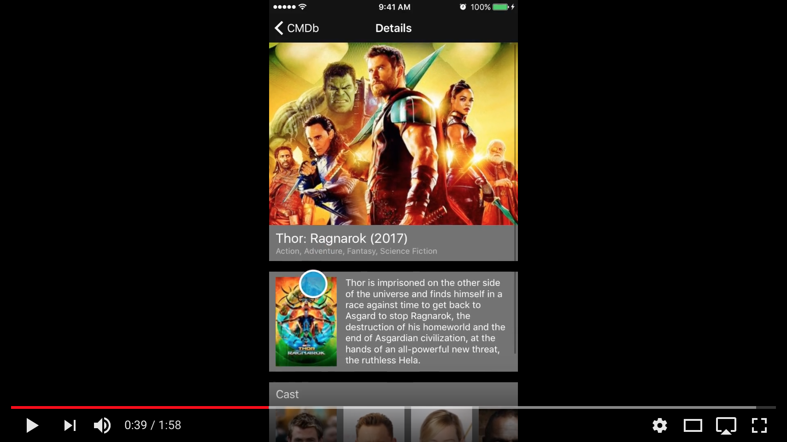

# CMDb

CMDb is an iOS app that fetches and displays movie details from TMDb (The Movie Database).
The app is written in **Swift 4** and uses a couple of third-party frameworks:
 - [iCarousel](https://github.com/nicklockwood/iCarousel) - to have the carousel effect
 - [Kingfisher](https://github.com/onevcat/Kingfisher) - for image downloading/caching tasks

### Home page
The home page consistes of three sections (selecting any movie shows its details):
  - Upcoming Movies
  - Popular Movies
  - Top Rated Movies

### Search Functionality
There's also a search button (and a search field that's scrolled up under the navigation bar initially) - which helps you search for any movie in the database.

> The datasource to display the search results is manually connected to the database (as the requirement stated that the database should be easily swappable to another technology like SQLite, Realm...) - and if I were to choose I'd use **Core Data** and would take full advantage of **NSFetchedResultsController** to handle the UI and Database connection.

### Demo Video

